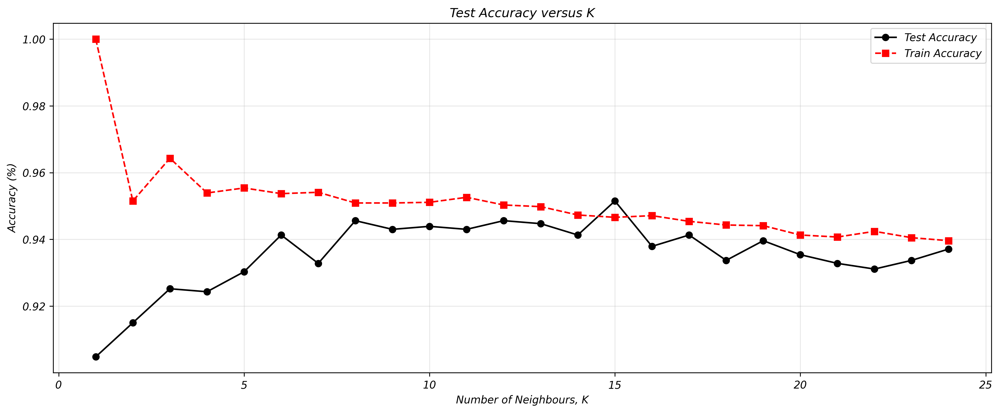
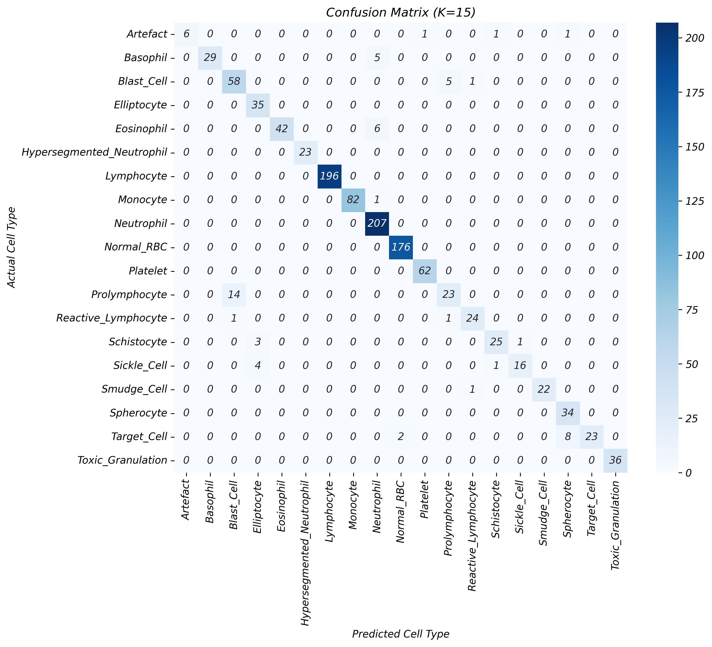
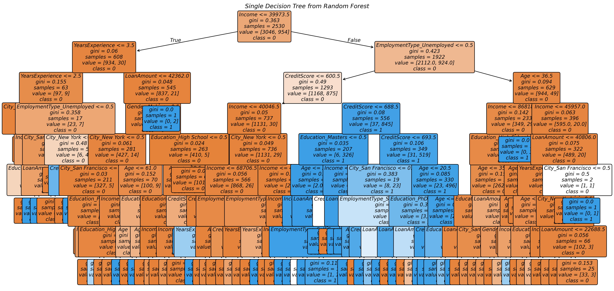
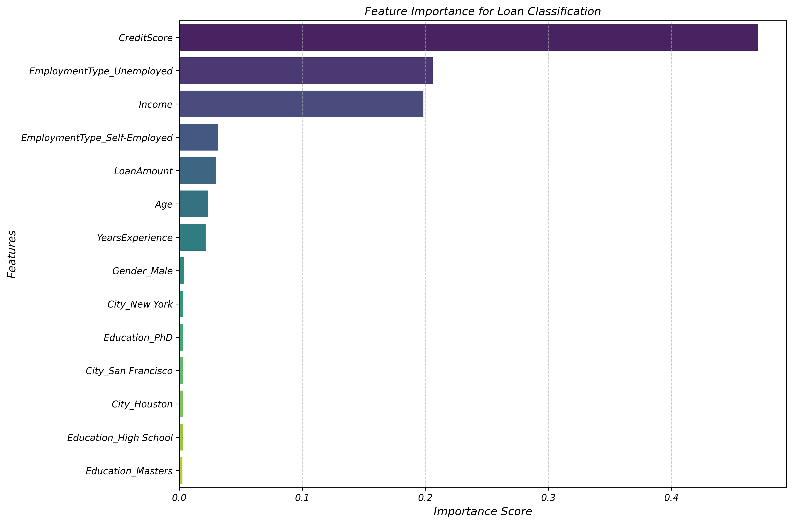
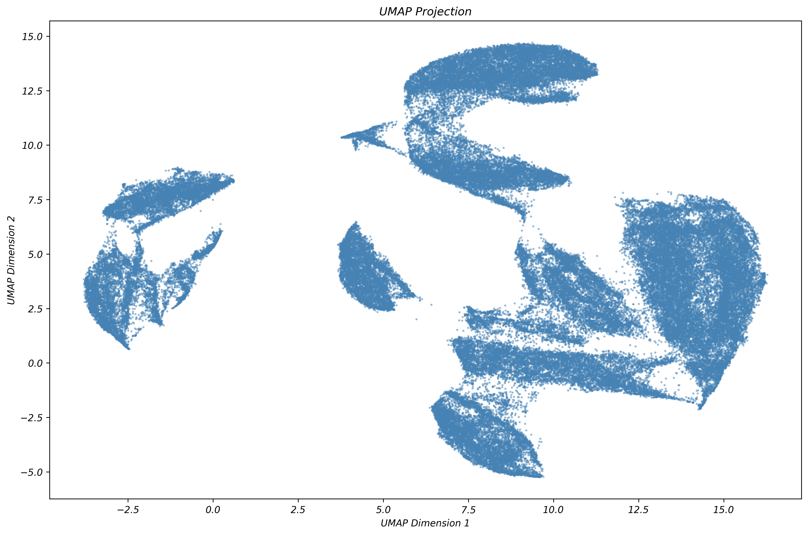
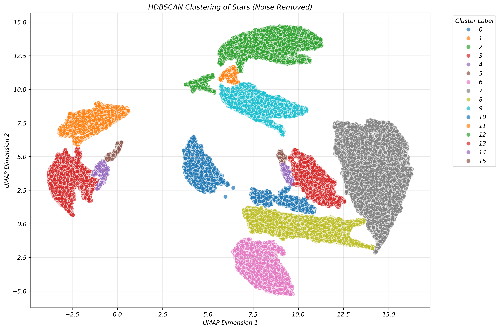

# Statistical Machine Learning Coursework

## Overview
This coursework project applies supervised and unsupervised machine learning techniques to three distinct datasets:
- **Blood Cell Classification** using K-Nearest Neighbours (KNN)
- **Loan Risk Prediction** using Random Forest
- **Gaia Star Clustering** using UMAP + HDBSCAN
The aim is to provide a brief overview of a variety of ML techniques to a range of different dataset.

---
## The Report

`Report.pdf` is the full written report submitted for marking. It achieved a 100% grade.  

---

## Requirements
- Python 3.13.11
- See `requirements.txt` for full list of dependencies

### Install dependencies
pip install -r requirements.txt

---

## Dataset
Three datasets are required to run this project:
- `blood_cell_anomaly_detection.csv` — Blood cell features and cell type labels
- `loan_risk_prediction_dataset.csv` — Loan applicant features and approval labels
- `gaia-dr2-rave-35.csv` — Gaia DR2 star catalogue with astrometric features

---

## Usage
Run the full pipeline:

python src/pipeline.py

---

## 1. Blood Cell Classification (KNN)
K-Nearest Neighbours is applied to classify blood cell types. Features are standardised
using `StandardScaler` before training. K values from 1 to 24 are evaluated to find
the optimal number of neighbours.

**Best K:** 15

### KNN Accuracy vs K

### Confusion Matrix (K=15)

---

## 2. Loan Risk Prediction (Random Forest)
A Random Forest classifier with 200 estimators and max depth of 8 is trained to predict
loan approval. Categorical variables are one-hot encoded prior to training. Out-of-bag
scoring is enabled to give an additional estimate of generalisation performance.

### Single Decision Tree from Forest

### Feature Importance

---

## 3. Gaia Star Clustering (UMAP + HDBSCAN)
100,000 stars are sampled from the Gaia DR2 catalogue. Features are standardised and
reduced to 2 dimensions using UMAP for visualisation. HDBSCAN is then applied to
identify clusters, with noise points (label = -1) removed from the final plot.

**HDBSCAN Parameters:**
- `min_cluster_size = 300`
- `min_samples = 10`
- `cluster_selection_method = 'eom'`

### UMAP Projection

### HDBSCAN Clustering (Noise Removed)
